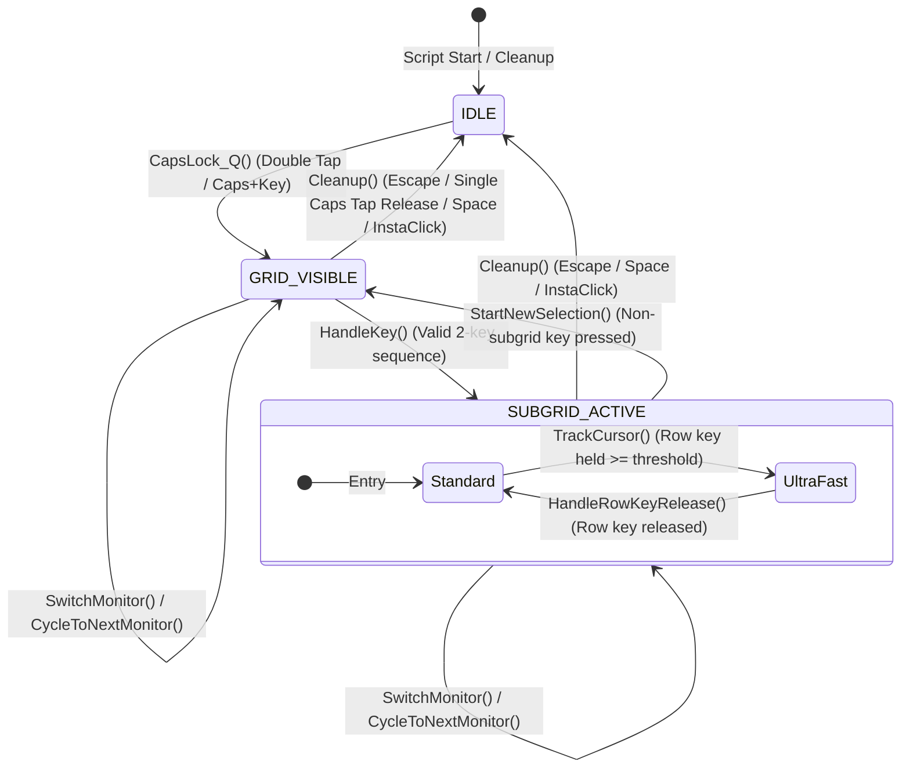
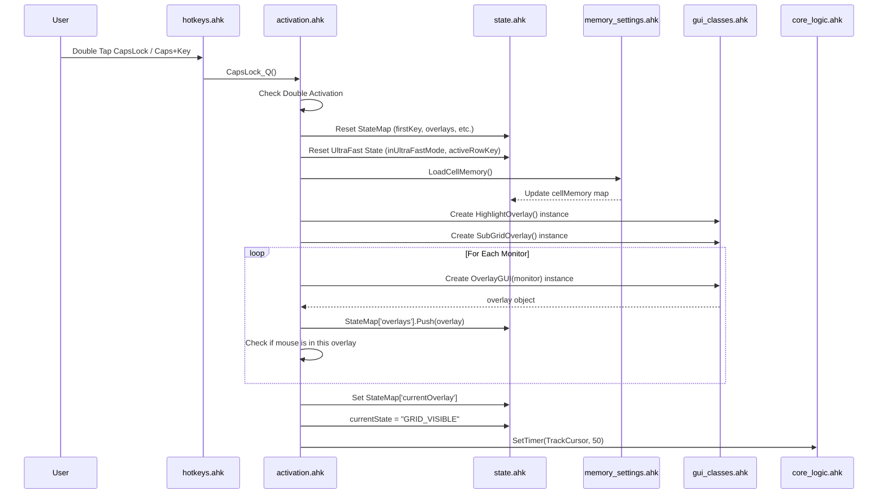
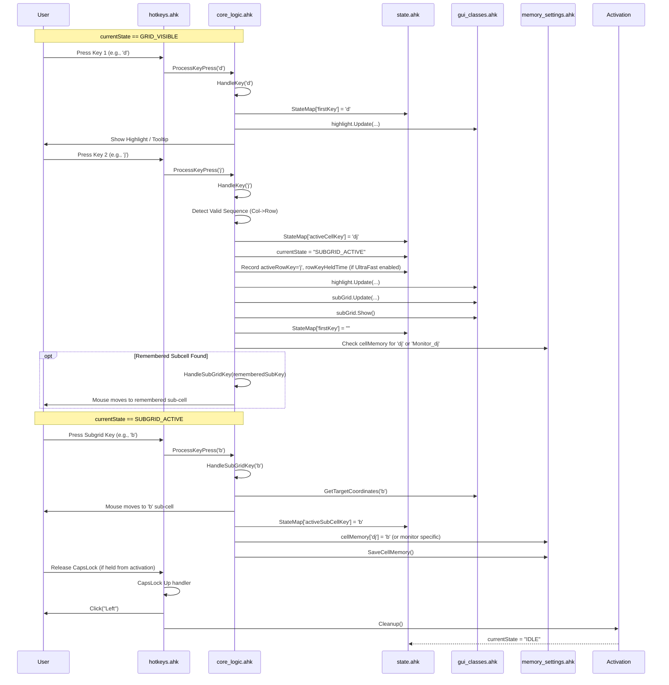

# AntiMouse Script Structure and Logic Flow

This document outlines the modular structure of the refactored AntiMouse AutoHotkey script, its high-level logic flow, subgrid activation mechanisms, and potential areas for improvement.

## Directory Structure

```
/main-scripts/antimouse-modular/
├── - structure of antimouse-modular -.md  (This file)
├── 1main.ahk                 (Entry point, includes, initialization)
├── activation.ahk            (Grid activation/cleanup logic: CapsLock_Q, Cleanup)
├── antimouse_settings.ini    (User configuration file)
├── cell_memory.txt           (Stores remembered sub-cell selections)
├── config.ahk                (Default settings, layout definitions, global constants)
├── core_logic.ahk            (State transitions, key handling, subgrid logic, cursor tracking)
├── debugRapidRefresh.log     (Debug log file - High frequency)
├── debug_log.txt             (Debug log file - Lower frequency)
├── gui_classes.ahk           (Classes for Grid, SubGrid, Highlight overlays)
├── hotkeys.ahk               (All hotkey definitions, context-sensitive)
├── memory_settings.ahk       (Functions to load/save settings and cell memory)
├── settings_gui.ahk          (GUI for viewing/editing settings)
├── state.ahk                 (Global state variables: currentState, StateMap, etc.)
└── utils.ahk                 (Utility functions: validation, GUI cleanup, etc.)
```

## Core Concepts

- **State Machine:** The script operates based on a `currentState` variable (`IDLE`, `GRID_VISIBLE`, `SUBGRID_ACTIVE`). Transitions are triggered by hotkeys and timers.
- **Grid Overlays:** Transparent GUI windows (`OverlayGUI` instances based on `GridOverlay`) are displayed over each monitor upon activation.
- **Cell Selection:** Typically a two-key sequence (Column Key + Row Key or vice-versa) selects a main grid cell (`activeCellKey`).
- **SubGrid:** Once a cell is selected (`currentState = SUBGRID_ACTIVE`), a smaller 2x2 grid (`SubGridOverlay`) appears over the cell, allowing finer positioning using `g,h,b,n` keys.
- **Ultra-Fast Subgrid:** An alternative 3x4 subgrid mode activated by holding the _second_ key (if it's a row key) for `rowKeyHoldThreshold` milliseconds. Uses `q,w,e,r,a,s,d,f,z,x,c,v` keys.
- **Cell Memory:** Remembers the last selected subgrid key (`g,h,b,n` or `ultra:q`, etc.) for each main grid cell (optionally per monitor). Loaded from `cell_memory.txt`, saved after each subgrid selection.
- **CapsLock Control:** CapsLock is central to activation and interaction:
     - Single Tap (Down+Up > `doubleCapsThreshold`): Cleans up the grid if active.
     - Double Tap (Down+Up+Down within `doubleCapsThreshold`): Activates the grid and enters `inHoldMode`.
     - Hold & Release (after Double Tap or Caps+Key activation): Performs an "InstaClick" at the final mouse position and cleans up.
     - Hold & Key (without prior Double Tap/Activation): Used for navigation/monitor switching while grid is active.
- **StateMap:** A global `Map` object holding most dynamic state (GUI objects, active keys, selected cells, ultra-fast status).
- **Configuration:** Loaded from `antimouse_settings.ini` at startup and saved via the settings GUI (`settings_gui.ahk`). Defaults are in `config.ahk`.

## Logic Flow Diagrams

### 1. Initialization Flow

```mermaid
graph TD
    Start[Script Start: 1main.ahk] --> Inc[Include Modules]
    Inc --> LoadSet[LoadSettings() from .ini]
    LoadSet --> LoadMem[LoadCellMemory() from .txt]
    LoadMem --> Timer[SetTimer ForceCapsLockOff]
    Timer --> Wait[Wait for Activation Hotkey]
```

### 2. Main State Machine



### 3. Grid Activation (`CapsLock_Q`)



### 4. Standard Cell & Subgrid Selection



### 5. Ultra-Fast Subgrid Activation & Usage

```mermaid
sequenceDiagram
    participant User
    participant Hotkeys as hotkeys.ahk
    participant Core as core_logic.ahk
    participant State as state.ahk
    participant GUI as gui_classes.ahk
    participant Memory as memory_settings.ahk

    Note over User, Core: currentState == GRID_VISIBLE
    User->>Hotkeys: Press Key 1 (e.g., 'd')
    Hotkeys->>Core: ProcessKeyPress('d')
    Core->>Core: HandleKey('d')
    Core->>State: StateMap['firstKey'] = 'd'

    User->>Hotkeys: Press & HOLD Key 2 (Row Key, e.g., 'j')
    Hotkeys->>Core: ProcessKeyPress('j')
    Core->>Core: HandleKey('j')
    Core->>State: StateMap['activeCellKey'] = 'dj'
    Core->>State: currentState = "SUBGRID_ACTIVE"
    Core->>State: StateMap['activeRowKey'] = 'j'
    Core->>State: StateMap['rowKeyHeldTime'] = A_TickCount
    Core->>GUI: subGrid.Show() (Standard Layout)
    Core->>State: StateMap['firstKey'] = ""

    loop TrackCursor Timer (every 50ms)
        Core->>Core: TrackCursor()
        Core->>State: GetKeyState('j', 'P') -> Physically Down?
        Core->>State: Get rowKeyHeldTime
        alt Row Key Held >= Threshold AND Physically Down
            Core->>State: StateMap['inUltraFastMode'] = true
            Core->>GUI: subGrid.SwitchToUltraFast()
            Core->>GUI: subGrid.Show() (Ultra-Fast Layout)
            break Hold Detected
        end
    end

    Note over User, Core: currentState == SUBGRID_ACTIVE, inUltraFastMode == true
    User->>Hotkeys: Press Ultra-Fast Key (e.g., 'r')
    Hotkeys->>Core: ProcessKeyPress('r')
    Core->>Core: HandleUltraFastKey('r')
    Core->>GUI: GetUltraFastTargetCoordinates('r')
    Core->>User: Mouse moves to 'r' ultra-fast sub-cell
    Core->>State: StateMap['activeSubCellKey'] = 'ultra:r'
    Core->>Memory: cellMemory['dj'] = 'ultra:r'
    Core->>Memory: SaveCellMemory()

    User->>Hotkeys: Release Row Key ('j')
    Hotkeys->>Hotkeys: j up handler
    Hotkeys->>Core: CheckRowKeyUpForUltraFast('j')
    Core->>Core: HandleRowKeyRelease('j')
    Core->>State: StateMap['inUltraFastMode'] = false
    Core->>State: StateMap['activeRowKey'] = ""
    Core->>GUI: subGrid.SwitchToStandard()

    User->>Hotkeys: Release CapsLock (if held)
    Hotkeys->>Hotkeys: CapsLock Up handler
    Hotkeys->>User: Click("Left")
    Hotkeys->>Activation: Cleanup()
    Activation-->>State: currentState = "IDLE"
```

## Analysis & Potential Issues

- **State Management Complexity:** The script juggles multiple state flags (`currentState`, `firstKey`, `inHoldMode`, `inUltraFastMode`, `activeRowKey`) and timers (`TrackCursor`, `ForceCapsLockOff`). This creates significant complexity and potential for race conditions or unexpected transitions, as evidenced by log errors like `HandleUltraFastKey: Wrong state (GRID_VISIBLE)`. The `keyProcessingLock` helps mitigate some re-entry issues in `HandleKey` but doesn't cover all concurrent operations.
- **CapsLock Logic:** The custom implementation for single-tap, double-tap, and hold detection is intricate and relies heavily on timing (`A_TickCount`, `doubleCapsThreshold`). This can be sensitive to system performance and user input variations, potentially leading to misinterpretations (e.g., treating a quick single tap as the start of a double tap, or vice-versa). The interaction between `inHoldMode` (set by double-tap/activation) and the `CapsLock & Key` hotkeys (for navigation when Caps is just held down) is particularly complex.
- **Ultra-Fast Mode Activation:** Triggering this mode depends on the `TrackCursor` timer (50ms interval) detecting that a row key is physically held down (`GetKeyState(..., "P")`) for longer than `rowKeyHoldThreshold` (default 150ms). This short threshold combined with the timer interval might lead to inconsistent activation depending on system load and precise key press/release timing.
- **GUI Handling:** The extensive use of `try...catch` around GUI operations (especially `Hide`, `Destroy`) and the existence of `ForceCloseAllGuis` suggest potential issues with GUI elements becoming invalid or not closing cleanly, possibly due to rapid state changes or errors during cleanup.
- **Performance:**
     - `TrackCursor`: Runs frequently (every 50ms) and performs potentially costly operations like `GetCellAtPosition` and `GetKeyState`. This could consume noticeable CPU, especially on lower-end systems.
     - `SaveCellMemory`: Writing the entire memory map to `cell_memory.txt` _after every single subgrid selection_ is highly inefficient and could cause noticeable pauses or disk I/O bottlenecks, especially as the file grows.
     - Debug Logging: The `debugRapidRefresh.log` involves frequent file writes, which will significantly impact performance when `showcaseDebug` is enabled.
- **Error Handling:** Primarily relies on suppressing errors with `try...catch` or showing basic `ToolTip`/`MsgBox` messages (often only in debug mode). This might hide underlying bugs.
- **Scalability:** The modular design is good for organization. However, the tight coupling between modules via global variables and the complex state logic in `core_logic.ahk` and `hotkeys.ahk` could make adding significant new features or refactoring difficult.

## Optimization & Conflict Resolution Ideas

- **State Management:** Simplify state transitions where possible. Consider using a more formal state machine library or pattern if complexity increases further. Carefully review interactions between `TrackCursor` and key handlers to prevent race conditions. Maybe `TrackCursor` should only _read_ state and _request_ state changes, rather than modifying `currentState` or `inUltraFastMode` directly.
- **CapsLock Logic:** Re-evaluate if the custom tap/double-tap/hold logic can be simplified or made less timing-dependent. AHK v2 might offer more robust ways to handle key states and sequences.
- **Ultra-Fast Mode:** Consider alternative activation methods less reliant on precise timing within a timer callback (e.g., requiring a specific modifier key held _with_ the row key). Increase the default `rowKeyHoldThreshold` slightly (e.g., 200-250ms) for more reliability.
- **Performance:**
     - `SaveCellMemory`: Change to save less frequently – perhaps periodically via `SetTimer`, only when the settings GUI is closed, or only on script exit (`OnExit`).
     - `TrackCursor`: Reduce frequency if possible (e.g., 75-100ms). Optimize the logic within, perhaps caching cell boundaries temporarily.
     - GUI: Explore reusing GUI windows more effectively instead of full creation/destruction on each cycle, if activation/deactivation is extremely rapid.
- **Error Handling:** Implement more specific error handling and logging, even outside debug mode, to better diagnose issues.
- **Code Style:** Adhere strictly to AHK v2 syntax and best practices. Remove redundant code (e.g., potentially some state resets).

This analysis provides a deep dive into the script's structure and potential areas for refinement.
