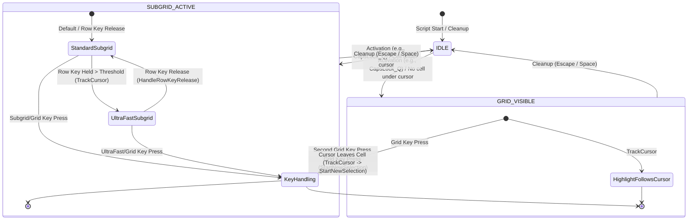

# AntiMouse Script Structure and Logic Flow

This document outlines the modular structure of the refactored AntiMouse AutoHotkey script, its high-level logic flow, subgrid activation mechanisms, and potential areas for improvement.

## Directory Structure

```
/main-scripts/antimouse-modular/
├── - structure of antimouse-modular -.md  (This file)
├── 1main.ahk                 ; Main entry point, initialization, includes
├── activation.ahk            ; Grid activation (CapsLock_Q) and cleanup logic
├── antimouse_core.log        ; Core diagnostic log file
├── antimouse_settings.ini    ; User settings storage
├── cell_memory.txt           ; Stores remembered cell->subcell mappings
├── config.ahk                ; Global configuration variables (layouts, keys, thresholds)
├── core/                     ; Directory for refactored core logic modules
│   ├── grid_keys.ahk         ; Handles main grid key presses (HandleKey)
│   ├── key_processing.ahk    ; Routes key presses based on state (ProcessKeyPress)
│   ├── monitor.ahk           ; Monitor switching logic (SwitchMonitor, CycleToNextMonitor)
│   ├── positioning.ahk       ; Cell finding logic (GetCellAtPosition)
│   ├── state_transitions.ahk ; Handles transitions between states (StartNewSelection)
│   ├── subgrid_keys.ahk      ; Handles subgrid/ultra-fast key presses and row release
│   └── tracking.ahk          ; Cursor tracking timer logic (TrackCursor)
├── debugRapidRefresh.log     ; Debug log for rapid events
├── debug_log.txt             ; General debug log (currently empty)
├── gui_classes.ahk           ; Class definitions for GUI overlays (Grid, SubGrid, Highlight)
├── hotkeys.ahk               ; All hotkey definitions (#HotIf contexts)
├── memory_settings.ahk       ; Functions for loading/saving settings and cell memory
├── settings_gui.ahk          ; Settings GUI creation and handling
├── state.ahk                 ; Global state variables (currentState, StateMap, etc.)
└── utils.ahk                 ; Utility functions (validation, GUI cleanup, etc.)
```

## Core Concepts

*   **States:** The script operates in distinct states: `IDLE`, `GRID_VISIBLE`, `SUBGRID_ACTIVE`. State transitions drive the script's behavior.
*   **Overlays:** Transparent GUI windows (`GridOverlay`, `SubGridOverlay`, `HighlightOverlay`) are displayed over monitors to show grid lines, cell keys, and selection highlights.
*   **StateMap:** A central `Map` object holding dynamic state during grid operation (active keys, selected indices, GUI objects, ultra-fast mode status, etc.).
*   **Two-Key Selection:** Main grid cells are selected using a two-key sequence (Column Key + Row Key or Row Key + Column Key).
*   **Subgrids:** Once a main cell is selected, a smaller subgrid (standard 2x2 or ultra-fast 3x4) appears within that cell for finer mouse positioning.
*   **Cell Memory:** The script remembers the last selected subcell for each main cell (optionally per monitor) in `cell_memory.txt`.
*   **Ultra-Fast Mode:** Holding a row key during subgrid activation triggers a larger 3x4 subgrid layout for faster selection.
*   **Activation:** Primarily triggered via CapsLock (double-tap or hold+key), managed by hotkeys and `g_ModifierState` tracking in `hotkeys.ahk` and `activation.ahk`.

## Logical Flow Description

1.  **Initialization (`1main.ahk`)**
    *   Sets AHK environment (`#Requires`, `#SingleInstance`, `CoordMode`, etc.).
    *   Includes all necessary modules in a specific order (Config -> State -> Utils/Classes -> Memory -> Core Logic -> Activation -> Settings -> Hotkeys).
    *   Calls `LoadSettings()` and `LoadCellMemory()` from `memory_settings.ahk`.
    *   Starts a timer (`ForceCapsLockOff` in `utils.ahk`) to ensure CapsLock stays off.
    *   Script becomes persistent, driven by hotkeys and timers.

2.  **Activation (e.g., CapsLock Double-Tap)**
    *   `CapsLock` hotkey (`hotkeys.ahk`) detects double-tap using `g_ModifierState` and timing.
    *   Calls `CapsLock_Q()` (`activation.ahk`).
    *   `CapsLock_Q()`:
        *   Checks if already active; if so, calls `Cleanup()` and exits.
        *   Prevents double activation using `gridActivationInProgress` flag and timing.
        *   Resets relevant `StateMap` variables and `g_firstKeyPressed`.
        *   Loads `cellMemory`.
        *   Gets layout config (`layoutConfigs` from `config.ahk`).
        *   Initializes `highlight` and `subGrid` GUI objects.
        *   Creates and shows `OverlayGUI` for each monitor, storing them in `StateMap['overlays']`. Determines `StateMap['currentOverlay']` based on initial mouse position.
        *   Sets `currentState = "GRID_VISIBLE"`.
        *   **Instant Subgrid Logic:**
            *   Calls `GetCellAtPosition()` (`core/positioning.ahk`) to find the cell under the cursor (`initialCellKey`).
            *   If a cell is found:
                *   Gets cell boundaries.
                *   Updates and shows `subGrid` and `highlight` overlays positioned over the cell.
                *   Sets `currentState = "SUBGRID_ACTIVE"`.
                *   Checks `cellMemory` for `initialCellKey` (and monitor-specific key if `storePerMonitor`).
                *   If memory exists: Calls `HandleSubGridKey()` or `HandleUltraFastKey()` (`core/subgrid_keys.ahk`) to move the mouse to the remembered sub-position.
                *   If no memory: Mouse stays put, user needs to press a subgrid key.
            *   If no cell found: State remains `GRID_VISIBLE`.
        *   Starts `TrackCursor` timer (`core/tracking.ahk`).

3.  **Key Handling (`ProcessKeyPress` in `core/key_processing.ahk`)**
    *   Called by most letter/symbol hotkeys defined in `hotkeys.ahk` (when state is not `IDLE`).
    *   **If `currentState == "GRID_VISIBLE"`:** Calls `HandleKey()`.
    *   **If `currentState == "SUBGRID_ACTIVE"`:**
        *   Checks if it's the `activeRowKey` being held (for ultra-fast) -> ignore repeat.
        *   Checks if in `inUltraFastMode`:
            *   If key is valid ultra-fast key -> calls `HandleUltraFastKey()`.
            *   Else -> ignore key.
        *   Checks if standard subgrid key -> calls `HandleSubGridKey()`.
        *   Checks if main grid key -> calls `StartNewSelection(key)` to reset to grid view.
        *   Else -> ignore key.

4.  **Grid Navigation (`HandleKey` in `core/grid_keys.ahk`)**
    *   Uses `g_firstKeyPressed` global to track sequence.
    *   **First Key:** Records key, determines target cell based on last selected row/col, updates `highlight`, moves mouse, waits for second key.
    *   **Second Key:**
        *   If valid sequence (Col->Row or Row->Col): Determines `cellKey`, sets `proceedToSubgrid = true`.
        *   If changing first key type (Col->Col or Row->Row): Updates `g_firstKeyPressed`, updates highlight/mouse, waits for new second key.
        *   If invalid: Resets `g_firstKeyPressed`.
    *   **If `proceedToSubgrid`:**
        *   Gets boundaries for `cellKey`.
        *   Sets `currentState = "SUBGRID_ACTIVE"`.
        *   Updates/shows `subGrid`.
        *   Checks `cellMemory` -> calls `HandleSubGridKey`/`HandleUltraFastKey` if memory exists.
        *   Resets `g_firstKeyPressed`.
        *   If second key was row key & ultra-fast enabled: Starts tracking hold time (`StateMap['rowKeyHeldTime']`, `StateMap['activeRowKey']`).

5.  **Subgrid Navigation (`HandleSubGridKey`/`HandleUltraFastKey` in `core/subgrid_keys.ahk`)**
    *   Calculates target coordinates within the subgrid using `subGrid` object methods.
    *   Moves mouse (`MouseMove`).
    *   Updates `StateMap['activeSubCellKey']`.
    *   Saves the `subKey` (or `"ultra:" + key`) to `cellMemory` for the `activeCellKey`.
    *   Calls `SaveCellMemory()`.

6.  **Ultra-Fast Mode (`TrackCursor` in `core/tracking.ahk`, `HandleRowKeyRelease` in `core/subgrid_keys.ahk`)**
    *   `TrackCursor` checks if `activeRowKey` is held longer than `rowKeyHoldThreshold` when `SUBGRID_ACTIVE`.
    *   If threshold met: Sets `StateMap['inUltraFastMode'] = true`, calls `subGrid.SwitchToUltraFast()`.
    *   If key released (`HandleRowKeyRelease` called from hotkey): Sets `StateMap['inUltraFastMode'] = false`, calls `subGrid.SwitchToStandard()`, clears `StateMap['activeRowKey']`.

7.  **State Transition: Subgrid -> Grid (`StartNewSelection` in `core/state_transitions.ahk`)**
    *   Called by `ProcessKeyPress` when a grid key is pressed during `SUBGRID_ACTIVE`.
    *   Hides `subGrid` and `highlight`.
    *   Resets state (`activeCellKey`, `activeSubCellKey`, `firstKey`, `g_firstKeyPressed`, ultra-fast state).
    *   Sets `currentState = "GRID_VISIBLE"`.
    *   Calls `HandleKey()` with the pressed grid key to start the new selection.

8.  **Cursor Tracking (`TrackCursor` in `core/tracking.ahk`)**
    *   Runs every 50ms when grid/subgrid is active.
    *   If `SUBGRID_ACTIVE` and cursor leaves cell -> calls `StartNewSelection("")`.
    *   If `GRID_VISIBLE` -> updates `highlight` position to follow cursor.
    *   Handles Ultra-Fast mode activation/deactivation based on row key hold time.

9.  **Cleanup (`Cleanup` in `activation.ahk`)**
    *   Called by Escape key, Space key (after click), or if activation fails.
    *   Stops `TrackCursor` timer.
    *   Sets `currentState = "IDLE"`.
    *   Resets state variables (`firstKey`, ultra-fast state, `g_ModifierState.inHoldMode`, `gridActivationInProgress`).
    *   Hides and destroys all GUI elements (`highlight`, `subGrid`, all `overlays`).
    *   Calls `ForceCloseAllGuis()` (`utils.ahk`) as a safeguard.

10. **Monitor Switching (`core/monitor.ahk`, `hotkeys.ahk`)**
    *   Hotkeys (Tab, CapsLock+Number, Number while grid active) call `CycleToNextMonitor()` or `SwitchMonitor()`.
    *   `SwitchMonitor()` uses `monitorMapping` (`config.ahk`), changes `StateMap['currentOverlay']`, moves mouse, attempts to restore `activeCellKey` and remembered subcell position from `cellMemory`.

## Logic Flow Diagrams

### High-Level State Diagram



### Activation Flow (`CapsLock_Q`)

```mermaid
flowchart TD
    A[Activation Triggered (e.g., CapsLock)] --> B{Already Active?};
    B -- Yes --> C[Cleanup()] --> Z[End];
    B -- No --> D[Reset State / Load Memory];
    D --> E[Create Overlays / Find Current];
    E --> F{Overlays Created?};
    F -- No --> G[Cleanup() / Error] --> Z;
    F -- Yes --> H[Set currentState = GRID_VISIBLE];
    H --> I[GetCellAtPosition(cursor)];
    I --> J{Cell Found?};
    J -- No --> K[Start TrackCursor Timer] --> Z;
    J -- Yes --> L[Get Cell Boundaries];
    L --> M{Boundaries Valid?};
    M -- No --> K;
    M -- Yes --> N[Update/Show SubGrid & Highlight];
    N --> O[Set currentState = SUBGRID_ACTIVE];
    O --> P{Remembered Subcell?};
    P -- Yes --> Q[HandleSubGridKey / HandleUltraFastKey];
    P -- No --> K;
    Q --> K;
```

### Key Processing Flow (`ProcessKeyPress`)

```mermaid
flowchart TD
    A[Key Press Hotkey] --> B[ProcessKeyPress(key)];
    B --> C{currentState?};
    C -- GRID_VISIBLE --> D[HandleKey(key)];
    C -- SUBGRID_ACTIVE --> E{UltraFast Active?};
    E -- Yes --> F{Is UltraFast Key?};
    F -- Yes --> G[HandleUltraFastKey(key)];
    F -- No --> H[Ignore Key];
    E -- No --> I{Is Standard Subgrid Key?};
    I -- Yes --> J[HandleSubGridKey(key)];
    I -- No --> K{Is Grid Key?};
    K -- Yes --> L[StartNewSelection(key)];
    K -- No --> M[Ignore Key];
    C -- IDLE --> N[Ignore / Handled by Activation];
    D --> Z[End];
    G --> Z;
    H --> Z;
    J --> Z;
    L --> Z;
    M --> Z;
    N --> Z;
```

### Subgrid Activation Detail

```mermaid
graph TD
    subgraph Activation [Initial Activation (CapsLock_Q)]
        A1[GetCellAtPosition] --> A2{Cell Found?}
        A2 -- Yes --> A3[Set State=SUBGRID_ACTIVE] --> A4[Show Subgrid] --> A5{Memory?} --> A6[HandleSubKey]
        A2 -- No --> A7[Set State=GRID_VISIBLE]
        A5 -- No --> A8[Wait for SubKey]
    end
    subgraph Navigation [Grid Navigation (HandleKey)]
        B1[Second Key Press] --> B2{Valid Sequence?}
        B2 -- Yes --> B3[Set State=SUBGRID_ACTIVE] --> B4[Show Subgrid] --> B5{Memory?} --> B6[HandleSubKey]
        B2 -- No --> B7[Update First Key / Reset]
        B5 -- No --> B8[Wait for SubKey]
    end
    A6 --> Exit[(Subgrid Active)]
    A8 --> Exit
    B6 --> Exit
    B8 --> Exit
```

## Potential Conflicts & Optimizations

1.  **State Management:**
    *   **Conflict:** Heavy reliance on numerous global variables (`currentState`, `g_firstKeyPressed`, `g_ModifierState`, `StateMap` elements) increases complexity and potential for conflicts, especially between timer-driven functions (`TrackCursor`) and hotkey handlers. The `g_firstKeyPressed` global seems particularly fragile due to multiple reset points.
    *   **Optimization:** Consider consolidating state further, perhaps using a more formal state machine pattern or reducing the number of globals. Encapsulating related state within classes could help. Refactor `HandleKey` to avoid the `static keyProcessingLock` if possible, perhaps by disabling conflicting hotkeys contextually.

2.  **Timing/Race Conditions:**
    *   **Conflict:** Use of `Sleep()` and manual locks (`keyProcessingLock`, `trackingInProgress`) suggests potential race conditions. State transitions triggered by timers (`TrackCursor`) might conflict with user input handled by hotkeys (`ProcessKeyPress`). The `stateTransitionDelay` adds artificial delays.
    *   **Optimization:** Minimize reliance on `Sleep()`. Explore using critical sections or more robust event handling if AHK v2 offers better mechanisms. Ensure state checks are atomic where necessary. Evaluate if the `TrackCursor` timer interval (50ms) is optimal or could be adjusted/replaced.

3.  **Error Handling:**
    *   **Conflict:** Inconsistent error handling (`Cleanup()`, logs, tooltips, silent ignores) can hide bugs. Errors during critical transitions (like Instant Subgrid activation) might leave the script in an invalid state.
    *   **Optimization:** Standardize error handling. Log errors consistently, potentially provide user feedback for critical failures, and ensure cleanup routines are robust even after partial failures.

4.  **Subgrid Activation:**
    *   **Conflict:** Instant Subgrid logic sets `currentState = SUBGRID_ACTIVE` *before* ensuring boundaries are valid or memory checks complete successfully. An error later could leave the state incorrect.
    *   **Optimization:** Refactor `CapsLock_Q` to only transition to `SUBGRID_ACTIVE` *after* all necessary steps (boundary check, memory lookup/handling) are confirmed successful.

5.  **Ultra-Fast Mode Trigger:**
    *   **Conflict:** Timer-based detection (50ms interval in `TrackCursor`) might feel slightly laggy or inconsistent for triggering ultra-fast mode.
    *   **Optimization:** Consider using a dedicated `SetTimer` started on row-key *down* and cancelled on *up* for more precise hold detection, potentially eliminating the need for the check within the main `TrackCursor` loop.

6.  **Code Clarity/Redundancy:**
    *   **Conflict:** Some logic appears duplicated (e.g., GUI hiding/destruction in `Cleanup` and other places). The purpose of `g_ModifierState` vs. direct `GetKeyState` checks could be clearer.
    *   **Optimization:** Refactor common sequences into helper functions. Consolidate state checks where possible. Clarify the CapsLock handling logic and the role of `g_ModifierState.inHoldMode`.

7.  **Scalability:**
    *   **Conflict:** Tight coupling between hotkeys, state variables, and core logic functions makes adding new features or significantly changing layouts complex.
    *   **Optimization:** Explore more data-driven approaches for layout definitions and key bindings to reduce hardcoding in `config.ahk` and `hotkeys.ahk`. Further modularization or object-oriented design could improve maintainability.
